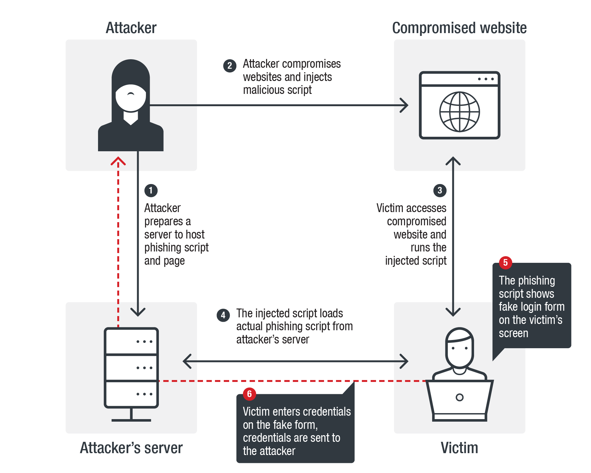

## Table of Contents

1. [Introduction](https://the-mind.github.io/OnlineSecurity/)
1. [Introduction to Cybersecurity](https://the-mind.github.io/OnlineSecurity/training/introduction)
1. [Cybersecurity Threats](https://the-mind.github.io/OnlineSecurity/training/cybersecuritythreats)
    * [3.1 Social Engineering](https://the-mind.github.io/OnlineSecurity/training/socialengineering)
    * [3.2 Malware](https://the-mind.github.io/OnlineSecurity/training/malware)
    * [3.3 Malicious Websites](https://the-mind.github.io/OnlineSecurity/training/maliciouswebsites)
1. [Personal Security](https://the-mind.github.io/OnlineSecurity/training/personalsecurity)
1. [Password Security](https://the-mind.github.io/OnlineSecurity/training/passwordsecurity)
1. [Secure Online Communications](https://the-mind.github.io/OnlineSecurity/training/securecommunications)
    * [6.1 Secure your Instant Messaging Apps](https://the-mind.github.io/OnlineSecurity/training/secureim)
    
# 3.3 Malicious Websites

Most people are unaware of the fact that you don’t have to intentionally download a malicious attachment in order to compromise your own computer’s security. 

__Malicious websites__ and __drive-by downloads__ are just two ways that your security can become compromised by doing nothing more than visiting a website. 

Both underpin the necessity of protecting your computer with a strong Internet Security Program.

## What is a malicious website? 
A malicious website is a site that attempts to install malware onto your device. This usually requires some action on the end user's part, however, in the case of a drive-by download, the website will attempt to install software on a computer without asking for permission first.

What’s more, malicious websites often look like legitimate websites. Sometimes they will ask you to install software that your computer appears to need. Similarly, the website might ask for permission to install one program, but install a completely different one -- one that you definitely do not want on your computer.

__Legitimate websites can be malicious too if compromised__

## What is a drive-by download ? 
Drive-by downloads are even scarier than a malicious website, though the two sometimes overlap. Drive-by downloads can be installed on your computer simply by looking at an email, browsing a website or clicking on a pop-up window with text designed to mislead you, such as a false error message. 

This type of malware is particularly frightening, because it’s basically impossible to know if you’ve done something to install the malware.

Drive-by downloads often don’t require your consent, or tricking you into giving it. Sometimes the malicious code hides deep in the code of the website. Once the download is on there, it can be difficult or impossible to get off of your computer, tablet or mobile phone. 

## How to check a website for malware of phishing attempts
The best way to protect yourself from malicious and phishing websites is to know how to detect one and also, to be prepared. 

[Here are free security tools that you can use for your online protection.](https://heimdalsecurity.com/blog/free-cyber-security-tools-list/){:target="_blank"}  

Here are some helpful tips that can help you:

### 1. Check if the URL page's is genuine
Phishing websites, in particular, will use URL structures that are similar to the target webpage. For example, the link name might be [instagran.com](www.instgran.com){:target="_blank"} instead of [instagram.com](www.instagram.com){:target="_blank"}.

For this reason, we strongly suggest you always glance at a page’s URL and check for anything out of the ordinary.

### 2. Most malicious websites don't use SSL or HTTPS
__SSL__, short for __Secure Socket Layer__, is a security certificate used in order to encrypt the communication sent between the browser and the site server.

Most malicious websites, and even phishing ones for that matter don’t use SSL since they are an extra cost and hassle.

Whenever you land on a new site you haven’t heard about, look at its URL structure and see if it starts with __“https://”__ , if it does, then it means the site is secure, and the communications sent between your browser and server are encrypted.

If it starts with __“http://”__ , then the site owner hasn’t acquired an SSL certificate, which should put you on your guard when doing business on that page. 

### 3. VirusTotal will scan the website and tell you if it’s malicious or not

[VirusTotal](https://www.virustotal.com/gui/home) is a free service that analyzes a URL link or file with dozens of antivirus programs, looking for malware or malicious links.

Whenever you are unsure if a site is safe or not, you can simply pop it into VirusTotal’s URL scan, and see if anything suspicious come up.

It’s very easy to use, and best of all, free.

### 4. Use an ad blocker 
If you are concerned about malvertising and other malicious ads, you could consider installing an ad blocker. This will prevent almost all types of ads from appearing on pages you visit, including malicious ones.

Here’s a [link that compares ad blockers](https://www.tomsguide.com/round-up/best-adblockers-privacy-extensions){:target="_blank"}, in case you would like an in-depth review of them.

### 5. Keep all of your software updated
Malicious websites with exploit kits embedded into them will hunt down vulnerabilities in your software, which then function as gates for more types of malware infections.

Keeping your software updated at all times can be a serious hassle that involves too many update pop-ups. 

### 6. Beware of shortened links
Malicious hackers user URL shorteners such as bitly or TinyURL, to disguise links to malicious websites by masking them. In other cases, URL shorteners will obfuscate the original link, so that antivirus or other security solutions have trouble detecting the malware hidden on the page.

Fortunately, there are dedicated tools that can check these shortened links to make sure you won’t end up somewhere you wish you hadn’t.

Here’s a short list of URL checkers to help you out:

* [Checkshorturl](http://www.checkshorturl.com/){:target="_blank"}
* [Getlinkinfo](http://www.getlinkinfo.com/){:target="_blank"}
* [Untiny](http://untiny.com/){:target="_blank"}
* [Linkexpander](http://www.linkexpander.com/){:target="_blank"}

## More quick tips for identifying malicious websites
1. Sites that say they have __“Scanned your computer and detected virus”__ should always be treated with suspicion. 
1. Poorly built sites where it is difficult to find the information you are looking for. If every link seems to lead to an advertisement, find a more legitimate site to conduct your business.
1. Often __“free downloads”__ install malware on your system.
1. Sites inundated with __“Buy Now”__ offers and pop-ups, indicates trouble.
1. __Browser Hijacking:__ If a site won’t allow you to access any other site, be suspicious! Has your homepage or search engine has been modified without your permission?

## Resources

[Comprehensive article by Heimdall Security](https://heimdalsecurity.com/blog/malicious-websites/){:target="_blank"}

## Activity

Take participants through identifying malicious websites practically. 

__Next__ > [4. Personal Security](https://the-mind.github.io/OnlineSecurity/training/personalsecurity)

