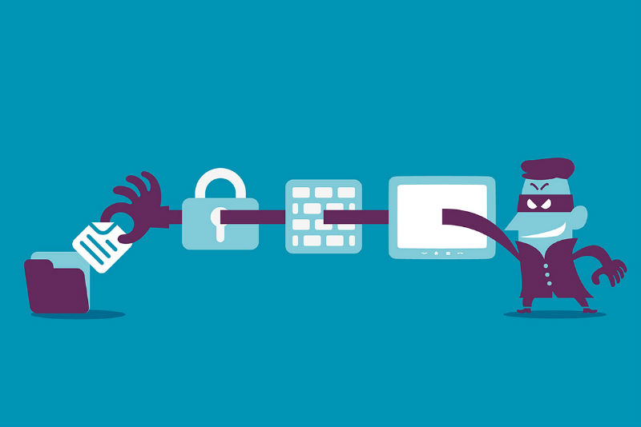
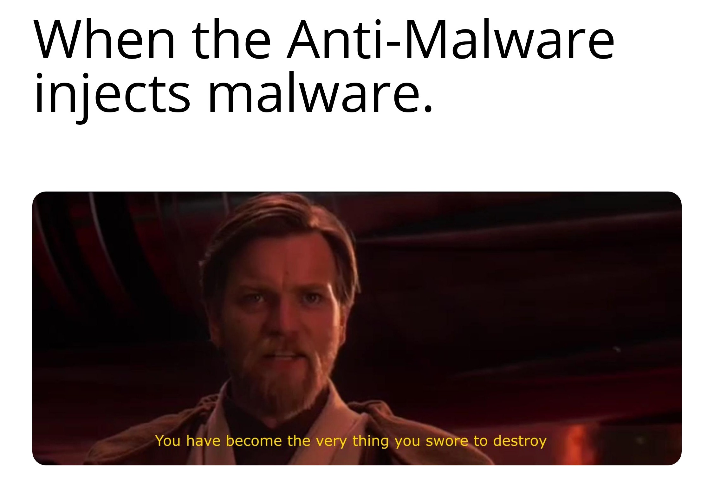

## Table of Contents

1. [Introduction](https://the-mind.github.io/OnlineSecurity/)
1. [Introduction to Cybersecurity](https://the-mind.github.io/OnlineSecurity/training/introduction)
1. [Cybersecurity Threats](https://the-mind.github.io/OnlineSecurity/training/cybersecuritythreats)
    * [3.1 Social Engineering](https://the-mind.github.io/OnlineSecurity/training/socialengineering)
    * [3.2 Malware](https://the-mind.github.io/OnlineSecurity/training/malware)
    * [3.3 Malicious Websites](https://the-mind.github.io/OnlineSecurity/training/maliciouswebsites)
1. [Personal Security](https://the-mind.github.io/OnlineSecurity/training/personalsecurity)
1. [Password Security](https://the-mind.github.io/OnlineSecurity/training/passwordsecurity)
1. [Secure Online Communications](https://the-mind.github.io/OnlineSecurity/training/securecommunications)
    * [6.1 Secure your Instant Messaging Apps](https://the-mind.github.io/OnlineSecurity/training/secureim) 
    
# 3.2 Malware 
Malware is short for __malicious software__, meaning software that can be used to compromise computer functions, steal data, bypass access controls, or otherwise cause harm to the host computer.

Malware is a broad term that refers to a variety of malicious programs. This module will define several of the most common types of malware such as  adware, spyware, Trojan horses, viruses, and worms.

## Different kinds of malware

### 1. Viruses 
A form of malware that is capable of copying itself and spreading to other computers. Viruses can be used to steal information, harm host computers and networks, create botnets, steal money, render advertisements, and more.
### 2. Ransomware 
A form of malware that essentially holds a computer system captive while demanding a ransom. The malware restricts user access to the computer either by encrypting files on the hard drive or locking down the system and displaying messages that are intended to force the user to pay the malware creator to remove the restrictions and regain access to their computer.
### 3. Spyware 
A type of malware that functions by spying on user activity without their knowledge. These spying capabilities can include activity monitoring,collecting keystrokes, data harvesting (account information, logins, financial data), and more. 
### 4. Adware 
A type of malware that delivers advertisements that are displayed by software. Often times software and applications offer “free” versions that come bundled with adware.
### 5. Rootkit 
A rootkit is a type of malicious software designed to remotely access or control a computer without being detected by users or security programs. Once a rootkit has been installed it is possible for the malicious party behind the rootkit to remotely execute files, access/steal information, modify system configurations, alter software (especially any security software that could detect the rootkit), install concealed malware, or control the computer as part of a botnet.
### 6. Trojan Horse 
Commonly known as a “Trojan,” is a type of malware that disguises itself as a normal file or program to trick users into downloading and installing malware. A Trojan can give a malicious party remote access to an infected computer. Once an attacker has access to an infected computer, it is possible for the attacker to steal data (logins, financial data, even electronic money), install more malware, modify files, monitor user activity (screen watching, keylogging, etc), use the computer in botnets, and anonymize internet activity by the attacker.

## Malware Symptoms

While these types of malware differ greatly in how they spread and infect computers, they all can produce similar symptoms.

Computers that are infected with malware can exhibit any of the following symptoms:
* Increased CPU usage
* Slow computer or web browser speeds
* Problems connecting to networks
* Freezing or frequent crashing of applications
* Modified or deleted files
* Appearance of strange files, programs, or desktop icons
* Programs running, turning off, or reconfiguring themselves (malware will often reconfigure or turn off antivirus and firewall programs)
* Strange computer behavior.
* Emails/messages being sent automatically and without user’s knowledge (a friend/colleague/correspondent receives a strange email from you that you did not send).

## Malware Prevention and Removal
There are several general best practices that organizations and individual users should follow to prevent malware infections. 

Some malware cases require special prevention and treatment methods, but following these recommendations will greatly increase a user’s protection from a wide range of malware:
* __Install and run anti-malware and firewall software__. When selecting software, choose a program that offers tools for detecting, quarantining, and removing multiple types of malware. At the minimum, anti-malware software should protect against viruses, spyware, adware, Trojans, and worms. The combination of anti-malware software and a firewall will ensure that all incoming and existing data gets scanned for malware and that malware can be safely removed once detected.
* __Keep software and operating systems up to date with current vulnerability patches.__ These patches are often released to patch bugs or other security flaws that could be exploited by attackers.
* __Be vigilant when downloading files, programs, attachments, etc__. Downloads that seem strange or are from an unfamiliar source often contain malware.

Next > [3.3 Malicious Websites](https://the-mind.github.io/OnlineSecurity/training/maliciouswebsites) 
